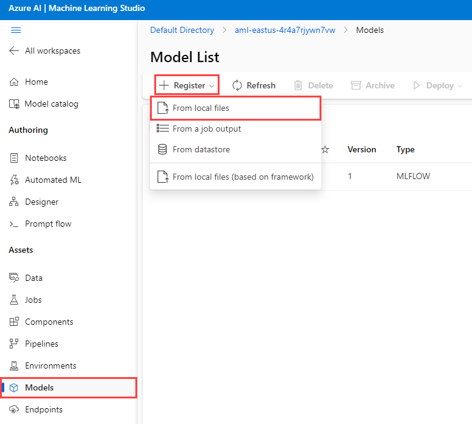

---
lab:
  title: Effectuer une inférence à l’aide d’Azure Machine Learning
  module: Use Azure Machine Learning Inferencing with Azure Database for PostgreSQL
---

# Effectuer une inférence à l’aide d’Azure Machine Learning

En tant que développeur principal pour Margie’s Travel (MT), vous avez été invité à développer une fonctionnalité d’estimation des prix de nuitée pour les locations à court terme. Vous avez collecté des données historiques dans un fichier texte et souhaitez les utiliser pour entraîner un modèle de régression simple dans Azure Machine Learning. Vous souhaitez ensuite utiliser ce modèle pour les données que vous avez hébergées dans une base de données de serveur flexible Azure Database pour PostgreSQL.

Dans cet exercice, vous allez déployer un modèle créé à l’aide de la fonctionnalité Machine Learning automatisée d’Azure Machine Learning. Vous allez ensuite utiliser ce modèle déployé pour estimer les prix de vente de la nuitée pour les locations à court terme.

## Avant de commencer

Vous avez besoin d’un [abonnement Azure](https://azure.microsoft.com/free) avec des droits d’administration.

### Déployer des ressources dans votre abonnement Azure

Cette étape vous guidera tout au long de l’utilisation des commandes Azure CLI à partir d’Azure Cloud Shell pour créer un groupe de ressources et exécuter un script Bicep afin de déployer les services Azure nécessaires pour effectuer cet exercice dans votre abonnement Azure.

1. Ouvrez un navigateur web et accédez au [portail Azure](https://portal.azure.com/).

2. Dans la barre d’outils du portail Azure, sélectionnez l’icône **Cloud Shell** pour ouvrir un nouveau volet [Cloud Shell](https://learn.microsoft.com/azure/cloud-shell/overview) en bas de la fenêtre de votre navigateur.

    

    Si vous y êtes invité, sélectionnez les options requises pour ouvrir un interpréteur de commandes *Bash*. Si vous avez déjà utilisé une console *PowerShell*, remplacez-la par un interpréteur de commandes *Bash*.

3. À l’invite Cloud Shell, entrez ce qui suit pour cloner le référentiel GitHub contenant des ressources d’exercice :

    ```bash
    git clone https://github.com/MicrosoftLearning/mslearn-postgresql.git
    ```

    Si vous avez déjà cloné ce référentiel GitHub dans un module précédent, il sera toujours disponible et le message d’erreur suivant pourrait s’afficher :

    ```bash
    fatal: destination path 'mslearn-postgresql' already exists and is not an empty directory.
    ```

    Si vous recevez ce message, vous pouvez passer en toute sécurité à l’étape suivante.

4. Exécutez ensuite trois commandes pour définir des variables afin de réduire les saisies redondantes lors de l’utilisation des commandes Azure CLI pour créer des ressources Azure. Les variables représentent le nom à affecter à votre groupe de ressources (`RG_NAME`), la région Azure (`REGION`) dans laquelle les ressources seront déployées et un mot de passe généré de manière aléatoire pour la connexion de l’administrateur PostgreSQL (`ADMIN_PASSWORD`).

    Dans la première commande, la région affectée à la variable correspondante est `eastus`, mais vous pouvez également la remplacer par un emplacement de votre choix. Toutefois, si vous remplacez la valeur par défaut, vous devez sélectionner une autre [région Azure qui prend en charge le résumé abstrait](https://learn.microsoft.com/azure/ai-services/language-service/summarization/region-support) pour être sûr de pouvoir effectuer toutes les tâches dans les modules de ce parcours d’apprentissage.

    ```bash
    REGION=eastus
    ```

    La commande suivante attribue le nom à utiliser pour le groupe de ressources qui hébergera toutes les ressources utilisées dans cet exercice. Le nom du groupe de ressources affecté à la variable correspondante est `rg-learn-postgresql-ai-$REGION`, où `$REGION` est l’emplacement que vous avez spécifié ci-dessus. Toutefois, vous pouvez le remplacer par tout autre nom de groupe de ressources de votre choix.

    ```bash
    RG_NAME=rg-learn-postgresql-ai-$REGION
    ```

    La commande finale génère de façon aléatoire un mot de passe pour la connexion d’administrateur PostgreSQL. Copiez-le dans un endroit sécurisé pour pouvoir l’utiliser ultérieurement et vous connecter à votre serveur flexible PostgreSQL.

    ```bash
    a=()
    for i in {a..z} {A..Z} {0..9}; 
       do
       a[$RANDOM]=$i
    done
    ADMIN_PASSWORD=$(IFS=; echo "${a[*]::18}")
    echo "Your randomly generated PostgreSQL admin user's password is:"
    echo $ADMIN_PASSWORD
    ```

5. Si vous avez accès à plusieurs abonnements Azure et que votre abonnement par défaut n’est pas celui dans lequel vous souhaitez créer le groupe de ressources et d’autres ressources pour cet exercice, exécutez cette commande pour définir l’abonnement approprié, en remplaçant le jeton `<subscriptionName|subscriptionId>` par le nom ou l’ID de l’abonnement que vous souhaitez utiliser :

    ```azurecli
    az account set --subscription <subscriptionName|subscriptionId>
    ```

6. Exécutez la commande Azure CLI suivante pour créer un groupe de ressources :

    ```azurecli
    az group create --name $RG_NAME --location $REGION
    ```

7. Enfin, utilisez Azure CLI pour exécuter un script de déploiement Bicep pour approvisionner des ressources Azure dans votre groupe de ressources :

    ```azurecli
    az deployment group create --resource-group $RG_NAME --template-file "mslearn-postgresql/Allfiles/Labs/Shared/deploy-azure-machine-learning.bicep" --parameters adminLogin=pgAdmin adminLoginPassword=$ADMIN_PASSWORD
    ```

    Le script de déploiement Bicep approvisionne les services Azure requis pour effectuer cet exercice dans votre groupe de ressources. Les ressources déployées incluent un serveur flexible Azure Database pour PostgreSQL et un espace de travail Azure Machine Learning. Le script de déploiement crée également tous les services requis pour instancier un espace de travail Azure Machine Learning, notamment un compte de stockage Blob Azure, un coffre Azure Key Vault, un référentiel de conteneurs Azure, un espace de travail Azure Log Analytics et une instance d’Azure Application Insights. Le script Bicep effectue également certaines étapes de configuration, telles que l’ajout des extensions `azure_ai` et `vector` à la _liste d’autorisation_ du serveur PostgreSQL (via le paramètre de serveur azure.extensions), et la création d’une base de données nommée `rentals` sur le serveur. **Notez que le fichier Bicep diffère des autres modules de ce parcours d’apprentissage.**

    Le déploiement prend généralement plusieurs minutes. Vous pouvez le surveiller à partir de Cloud Shell ou accéder à la page **Déploiements** du groupe de ressources que vous avez créé ci-dessus et observer la progression du déploiement.

8. Fermez le volet Cloud Shell une fois votre déploiement de ressources terminé.

### Résoudre les erreurs de déploiement

Vous pouvez rencontrer quelques erreurs lors de l’exécution du script de déploiement Bicep.

- Si vous avez précédemment exécuté le script de déploiement Bicep pour ce parcours d’apprentissage et supprimé par la suite les ressources, vous pouvez recevoir un message d’erreur semblable à ce qui suit si vous tentez de réexécuter le script dans les 48 heures suivant la suppression des ressources :

    ```bash
    {"code": "InvalidTemplateDeployment", "message": "The template deployment 'deploy' is not valid according to the validation procedure. The tracking id is '4e87a33d-a0ac-4aec-88d8-177b04c1d752'. See inner errors for details."}
    
    Inner Errors:
    {"code": "FlagMustBeSetForRestore", "message": "An existing resource with ID '/subscriptions/{subscriptionId}/resourceGroups/rg-learn-postgresql-ai-eastus/providers/Microsoft.CognitiveServices/accounts/{accountName}' has been soft-deleted. To restore the resource, you must specify 'restore' to be 'true' in the property. If you don't want to restore existing resource, please purge it first."}
    ```

    Si vous recevez ce message, modifiez la commande `azure deployment group create` ci-dessus pour définir le paramètre `restore` égal à `true` et réexécutez-la.

- Si la région sélectionnée est limitée à l’approvisionnement de ressources spécifiques, vous devez définir la variable `REGION` à un autre emplacement et réexécuter les commandes pour créer le groupe de ressources et exécuter le script de déploiement Bicep.

    ```bash
    {"status":"Failed","error":{"code":"DeploymentFailed","target":"/subscriptions/{subscriptionId}/resourceGroups/{resourceGrouName}/providers/Microsoft.Resources/deployments/{deploymentName}","message":"At least one resource deployment operation failed. Please list deployment operations for details. Please see https://aka.ms/arm-deployment-operations for usage details.","details":[{"code":"ResourceDeploymentFailure","target":"/subscriptions/{subscriptionId}/resourceGroups/{resourceGrouName}/providers/Microsoft.DBforPostgreSQL/flexibleServers/{serverName}","message":"The resource write operation failed to complete successfully, because it reached terminal provisioning state 'Failed'.","details":[{"code":"RegionIsOfferRestricted","message":"Subscriptions are restricted from provisioning in this region. Please choose a different region. For exceptions to this rule please open a support request with Issue type of 'Service and subscription limits'. See https://review.learn.microsoft.com/en-us/azure/postgresql/flexible-server/how-to-request-quota-increase for more details."}]}]}}
    ```

- Si le script ne parvient pas à créer une ressource IA en raison de la nécessité d’accepter le contrat d’IA responsable, vous pouvez rencontrer l’erreur suivante. Dans ce cas, utilisez l’interface utilisateur du portail Azure pour créer une ressource Azure AI Services, puis réexécutez le script de déploiement.

    ```bash
    {"code": "InvalidTemplateDeployment", "message": "The template deployment 'deploy' is not valid according to the validation procedure. The tracking id is 'f8412edb-6386-4192-a22f-43557a51ea5f'. See inner errors for details."}
     
    Inner Errors:
    {"code": "ResourceKindRequireAcceptTerms", "message": "This subscription cannot create TextAnalytics until you agree to Responsible AI terms for this resource. You can agree to Responsible AI terms by creating a resource through the Azure Portal then trying again. For more detail go to https://go.microsoft.com/fwlink/?linkid=2164190"}
    ```

## Déployer un modèle Azure Machine Learning

La première étape consiste à déployer un modèle sur Azure Machine Learning. Le référentiel contient un exemple de modèle entraîné sur un ensemble de données d’annonce, que vous utiliserez dans votre intégration PostgreSQL.

1. Téléchargez le fichier `mlflow-model.zip` à partir du [référentiel mslearn-postgresql](../../Allfiles/Labs/Shared/mlflow-model.zip). Extrayez les fichiers dans un dossier appelé **mlflow-model**.

2. Dans le [portail Azure](https://portal.azure.com/), accédez à votre espace de travail Azure Machine Learning nouvellement créé.

3. Sélectionnez le bouton **Lancer Studio**pour ouvrir Azure Machine Learning Studio.

    

4. Sélectionnez l’option de menu **Espaces de travail** et choisissez votre espace de travail Azure Machine Learning nouvellement créé.

    

5. Sélectionnez l’option de menu **Modèles** dans le menu **Ressources**. Sélectionnez l’option de menu **+ Enregistrer**, puis choisissez **À partir de fichiers locaux**.

    

6. Dans le menu **Charger un modèle**, définissez le type de modèle sur **MLflow**. Choisissez ensuite **Parcourir** et accédez à votre dossier **mlflow-model**, en chargeant les ressources. Puis,sélectionnez le bouton **Suivant** pour continuer.

    

7. Nommez le modèle **RentalListings**, puis sélectionnez le bouton **Suivant**.

    

8. Sélectionnez le bouton **Enregistrer** pour terminer l’enregistrement du modèle. Cette action vous redirige à la page **Modèles**. Sélectionnez le modèle que vous venez de créer.

    > [!Note]
    >
    > Si vous ne voyez pas de modèle, sélectionnez le bouton de l’option de menu **Actualiser** pour recharger la page. Vous devriez ensuite voir le modèle **RentalListings**

9. Sélectionnez l’option **Déployer** et créez un **point de terminaison en temps réel**.

    

10. Dans le menu volant de déploiement, définissez la **machine virtuelle** sur **Standard_DS2_v2** ou quelque chose de similaire, et le **nombre d’instances** sur 1. Sélectionnez le bouton **Déployer**. Le déploiement peut prendre plusieurs minutes, car le processus de déploiement inclut l’approvisionnement d’une machine virtuelle et le déploiement du modèle en tant que conteneur Docker.

    

11. Une fois le point de terminaison déployé, accédez à l’onglet **Consommer** et copiez le point de terminaison REST et la clé primaire pour pouvoir les utiliser dans la section suivante.

    

12. Pour tester le bon fonctionnement de votre point de terminaison, vous pouvez utiliser l’onglet **Test** de votre point de terminaison. Ensuite, collez le bloc suivant, en remplaçant toute entrée qui existe actuellement. Sélectionnez le bouton **Tester** et vous devez voir une sortie JSON contenant un tableau avec une valeur décimale unique indiquant le montant en dollars des États-Unis qu’une nuitée pour cette location particulière pourrait vous rapporter.

    ```json
    {
        "input_data": {
            "columns": [
                "host_is_superhost",
                "host_has_profile_pic",
                "host_identity_verified",
                "neighbourhood_group_cleansed",
                "zipcode",
                "property_type",
                "room_type",
                "accommodates",
                "bathrooms",
                "bedrooms",
                "beds"
            ],
            "index": [0],
            "data": [["0", "0", "0", "Central Area", "98122", "House", "Entire home/apt", 4, 1.5, 3, 3]]
        }
    }
    ```

    

## Se connecter à votre base de données avec psql dans Azure Cloud Shell

Dans cette tâche, vous allez vous connecter à la base de données `rentals` sur votre serveur flexible Azure Database pour PostgreSQL à l’aide de l’[utilitaire de ligne de commande psql](https://www.postgresql.org/docs/current/app-psql.html) à partir d’[Azure Cloud Shell](https://learn.microsoft.com/azure/cloud-shell/overview).

1. Dans le [portail Azure](https://portal.azure.com/), accédez à votre serveur flexible Azure Database pour PostgreSQL nouvellement créé.

2. Dans le menu de ressource, dans **Paramètres**, sélectionnez **Bases de données**, puis **Connecter** pour la base de données `rentals`.

    

3. À l’invite « Mot de passe pour l’utilisateur pgAdmin » dans Cloud Shell, entrez le mot de passe généré de manière aléatoire pour la connexion **pgAdmin**.

    Une fois connecté, l’invite `psql` de la base de données `rentals` s’affiche.

4. Tout au long de cet exercice, vous continuez à travailler dans Cloud Shell. Il peut donc être utile d’étendre le volet dans la fenêtre de votre navigateur en sélectionnant le bouton **Agrandir** en haut à droite du volet.

    

## Installer et configurer l’extension `azure_ai`

Avant d’utiliser l’extension `azure_ai`, vous devez l’installer dans votre base de données et la configurer pour vous connecter à vos ressources Azure AI Services. L’extension `azure_ai` vous permet d’intégrer les services Azure OpenAI et Azure AI Language dans votre base de données. Pour activer l’extension dans votre base de données, procédez comme suit :

1. Exécutez la commande suivante à l’invite `psql` pour vérifier que les extensions `azure_ai` et `vector` ont été correctement ajoutées à la _liste d’autorisation_ de votre serveur par le script de déploiement Bicep que vous avez exécuté lors de la configuration de votre environnement :

    ```sql
    SHOW azure.extensions;
    ```

    La commande affiche la liste des extensions sur la _liste d’autorisation_ du serveur. Si tout a été correctement installé, votre sortie doit inclure `azure_ai` et `vector`, comme suit :

    ```sql
     azure.extensions 
    ------------------
     azure_ai,vector
    ```

    Avant qu’une extension ne puisse être installée et utilisée dans un serveur flexible Azure Database pour PostgreSQL, elle doit être ajoutée à la _liste d’autorisation_ du serveur, comme décrit dans [Guide pratique pour utiliser les extensions PostgreSQL](https://learn.microsoft.com/azure/postgresql/flexible-server/concepts-extensions#how-to-use-postgresql-extensions).

2. Vous pouvez désormais installer l’extension `azure_ai` à l’aide de la commande [CREATE EXTENSION](https://www.postgresql.org/docs/current/sql-createextension.html).

    ```sql
    CREATE EXTENSION IF NOT EXISTS azure_ai;
    ```

    `CREATE EXTENSION` charge une nouvelle extension dans la base de données en exécutant son fichier de script. Ce script crée généralement de nouveaux objets SQL tels que des fonctions, des types de données et des schémas. Une erreur est générée si une extension du même nom existe déjà. L’ajout de `IF NOT EXISTS` permet à la commande de s’exécuter sans générer d’erreur si elle est déjà installée.

3. Vous devez ensuite utiliser la fonction `azure_ai.set_setting()` pour configurer la connexion à votre point de terminaison déployé Azure Machine Learning. Configurez les paramètres `azure_ml` pour pointer vers votre point de terminaison déployé et sa clé. La valeur de `azure_ml.scoring_endpoint` correspondra à l’URL REST de votre point de terminaison. La valeur de `azure_ml.endpoint_key` correspondra à la valeur de la clé 1 ou de la clé 2.

    ```sql
    SELECT azure_ai.set_setting('azure_ml.scoring_endpoint','https://<YOUR_ENDPOINT>.<YOUR_REGION>.inference.ml.azure.com/score');
    ```

    ```sql
    SELECT azure_ai.set_setting('azure_ml.endpoint_key', '<YOUR_KEY>');
    ```

## Créer une table contenant des annonces à tarifer

Vous aurez besoin d’une table pour stocker les annonces de location à court terme que vous souhaitez tarifer.

1. Exécutez la commande suivante dans la base de données `rentals` pour créer la table `listings_to_price`.

    ```sql
    CREATE TABLE listings_to_price (
        id INT GENERATED BY DEFAULT AS IDENTITY PRIMARY KEY,
        host_is_superhost INT NOT NULL,
        host_has_profile_pic INT NOT NULL,
        host_identity_verified INT NOT NULL,
        neighbourhood_group_cleansed VARCHAR(75) NOT NULL,
        zipcode VARCHAR(5) NOT NULL,
        property_type VARCHAR(30) NOT NULL,
        room_type VARCHAR(30) NOT NULL,
        accommodates INT NOT NULL,
        bathrooms DECIMAL(3,1) NOT NULL,
        bedrooms INT NOT NULL,
        beds INT NOT NULL
    );
    ```

2. Exécutez ensuite la commande suivante dans la base de données `rentals` pour insérer de nouvelles données d’annonces de location.

    ```sql
    INSERT INTO listings_to_price(host_is_superhost, host_has_profile_pic, host_identity_verified,
        neighbourhood_group_cleansed, zipcode, property_type, room_type,
        accommodates, bathrooms, bedrooms, beds)
    VALUES
        (1, 1, 1, 'Queen Anne', '98119', 'House', 'Private room', 2, 1.0, 1, 1),
        (0, 1, 1, 'University District', '98105', 'Apartment', 'Entire home/apt', 4, 1.5, 2, 2),
        (0, 0, 0, 'Central Area', '98122', 'House', 'Entire home/apt', 4, 1.5, 3, 3),
        (0, 0, 0, 'Downtown', '98101', 'House', 'Entire home/apt', 4, 1.5, 3, 3),
        (0, 0, 0, 'Capitol Hill', '98122', 'House', 'Entire home/apt', 4, 1.5, 3, 3);
    ```

    Cette commande insère cinq lignes de nouvelles données d’annonces.

## Créer une fonction pour traduire des données d’annonces

Pour remplir la table de traduction linguistique, vous allez créer une procédure stockée pour charger des données par lots.

1. Exécutez la commande suivante à l’invite `psql` pour créer une fonction nommée `price_listing`.

    ```sql
    CREATE OR REPLACE FUNCTION price_listing (
        IN host_is_superhost INT, IN host_has_profile_pic INT, IN host_identity_verified INT,
        IN neighbourhood_group_cleansed VARCHAR(75), IN zipcode VARCHAR(5), IN property_type VARCHAR(30),
        IN room_type VARCHAR(30), IN accommodates INT, IN bathrooms DECIMAL(3,1), IN bedrooms INT, IN beds INT)
    RETURNS DECIMAL(6,2)
    AS $$
        SELECT CAST(jsonb_array_elements(inference.inference) AS DECIMAL(6,2)) AS expected_price
        FROM azure_ml.inference(('
        {
            "input_data": {
                "columns": [
                    "host_is_superhost",
                    "host_has_profile_pic",
                    "host_identity_verified",
                    "neighbourhood_group_cleansed",
                    "zipcode",
                    "property_type",
                    "room_type",
                    "accommodates",
                    "bathrooms",
                    "bedrooms",
                    "beds"
                ],
                "index": [0],
                "data": [["' || host_is_superhost || '", "' || host_has_profile_pic || '", "' || host_identity_verified || '", "' ||
                neighbourhood_group_cleansed || '", "' || zipcode || '", "' || property_type || '", "' || room_type || '", ' ||
                accommodates || ', ' || bathrooms || ', ' || bedrooms || ', ' || beds || ']]
            }
        }')::jsonb, deployment_name=>'rentallistings-1');
    $$ LANGUAGE sql;
    ```

    > [!Note]
    >
    > Par défaut, le nom du déploiement est une combinaison du nom du modèle (**locationlistings**) et du numéro de version (**1**). Si vous déployez une nouvelle version du modèle et utilisez le nom de déploiement par défaut, le nouveau nom de déploiement est **locationlistings-2**.

2. Exécutez la fonction à l’aide de la commande SQL suivante :

    ```sql
    SELECT * FROM price_listing(0, 0, 0, 'Central Area', '98122', 'House', 'Entire home/apt', 4, 1.5, 3, 3);
    ```

    Cette requête retourne une estimation du prix de la nuitée de la location au format décimal.

3. Appelez la fonction pour chaque ligne de la table `listings_to_price` à l’aide de la commande SQL suivante :

    ```sql
    SELECT l2p.*, expected_price
    FROM listings_to_price l2p
        CROSS JOIN LATERAL price_listing(l2p.host_is_superhost, l2p.host_has_profile_pic, l2p.host_identity_verified,
            l2p.neighbourhood_group_cleansed, l2p.zipcode, l2p.property_type, l2p.room_type,
            l2p.accommodates, l2p.bathrooms, l2p.bedrooms, l2p.beds) expected_price;
    ```

    Cette requête retourne cinq lignes, une pour chaque ligne dans `listings_to_price`. Elle inclut toutes les colonnes de la table `listings_to_price` et le résultat de la fonction `price_listing()` en tant que `expected_price`.

## Nettoyage

Une fois cet exercice terminé, supprimez les ressources Azure que vous avez créées. La capacité configurée vous est facturée, et non la quantité de base de données utilisée. Suivez ces instructions pour supprimer votre groupe de ressources et toutes les ressources que vous avez créées pour ce labo.

1. Ouvrez un navigateur web et accédez au [portail Azure](https://portal.azure.com/), puis, dans la page d’accueil, dans Services Azure, sélectionnez **Groupes de ressources**.

    

2. Dans le filtre de n’importe quelle zone de recherche de champ, entrez le nom du groupe de ressources que vous avez créé pour ce labo, puis sélectionnez le groupe de ressources dans la liste.

3. Dans la page **Vue d’ensemble** de votre groupe de ressources, sélectionnez **Supprimer le groupe de ressources**.

    

4. Dans la boîte de dialogue de confirmation, entrez le nom de votre groupe de ressources pour confirmer, puis sélectionnez **Supprimer**.
